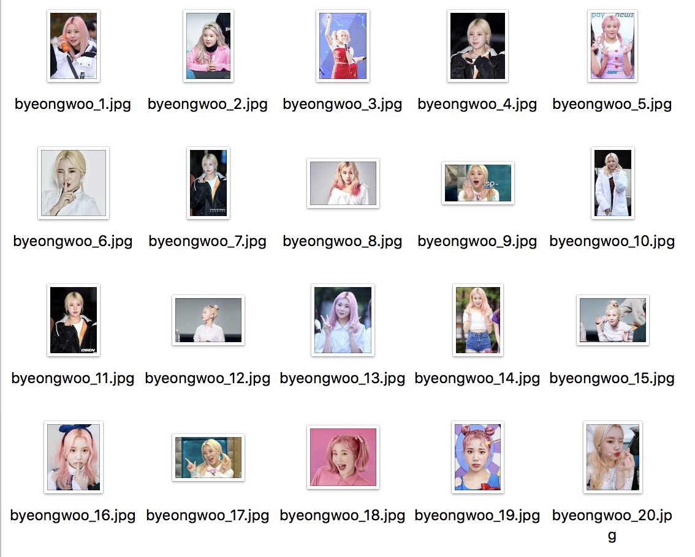

오늘은 파이썬 명령행에 원하는 이미지 제목을 넣어 구글 이미지 크롤링후 이미지 저장를 해보는 것 을 포스팅해보려합니다.
>웹 크롤러란?<br>
===
우리가 어떤 정보를 브라우저에서만 보는 것 뿐 아니라 그 정보들을 내가 이용하기 편한 방식(ex: json)으로 로컬에 저장하고 싶을 때가 있다.
HTTrack의 경우에는 웹을 그대로 자신의 컴퓨터로 복사를 해오지만, 내가 원하는 방식으로의 가공까지는 제공해주지 않는다.
Python을 이용하면 간단한 코드 몇줄 만으로도 쉽게 웹 사이트에서 원하는 정보만을 가져올 수 있다.

<br>

기존 크롤러들은 크롤링에 코드에 원하는 검색 키워드를 넣어 정보를 저장하는 방식인데,<br>
그 방식은 사용자가 원하는 키워드값이 있으면 코드를 바꾸는 방식 이였습니다.<br><br>

.png)<br><br>
저는 코드를 바꾸지 않고 위의 사진과 같이 '주이'라는 키워드와 같이 제가 원하는 키워드를 넣어 그 키워드를 크롤링후 이미지로 저장하고 싶었습니다.<br>
파이썬에서는 명령행에 원하는 인자값을 넣을 수있는데 저는 그중에 argparse 모듈을 사용해<br>
인자값에 이미지의 검색 키워드를 넣고 키워드에 일치하는 문서를 크롤링후 이미지 저장을 하는 방식으로 다음과 같이 코드를 작성하였습니다 

__코드 및 주석__

```python
# 내장함수
from urllib.request import urlopen
# 명령행 파싱 모듈 argparse 모듈 사용
import argparse
# request => 요청하는거를 웹에 요청한 결과값을 얻어올수 있는 모듈
import requests as req
# 웹에 요청한 결과를 보내주는 모듈
from bs4 import BeautifulSoup
parser = argparse.ArgumentParser()
#argparse 모듈 에 ArgumentParse() 함수 사용하여 parser 생성
parser.add_argument("-name", "--people", required=True)
#  명령행 옵션을 지정하기 위해 사용합니다 명령행 옵션 인자는 -name으로 지정
args = parser.parse_args()
#parse에 add_argument()함수 사용해 args 인스턴스생성
people = args.people
# 명령행에서 받은 인자값을 people에 값을 넘겨줌
def main():
    # 사용한 구글 url https://www.google.co.kr/search?q=%EB%B2%A4&tbm=isch
    url_info = "https://www.google.co.kr/search?"
    #params에 딕션을 넣어줌
    params = {
        #명령행에서 받은 인자값을 people로 넣어줌
        "q" : people,
        "tbm":"isch"
    }
    #url 요청 파싱값
    html_object = req.get(url_info,params) #html_object html source 값

    if html_object.status_code == 200:
        #페이지 status_code 가 200 일때 2XX 는 성공을 이야기함
        bs_object = BeautifulSoup(html_object.text,"html.parser")
        #인스턴스 생성
        img_data = bs_object.find_all("img")
        #인스턴스의 find_all 이라는 함수에 img 태그가 있으면 img_data에 넣어줌

        for i in enumerate(img_data[1:]):
            #딕셔너리를 순서대로 넣어줌
            t = urlopen(i[1].attrs['src']).read()
            filename = "byeongwoo_"+str(i[0]+1)+'.jpg'
            with open(filename,"wb") as f:
                f.write(t)
            print("Img Save Success")

if __name__=="__main__":
    main()
```
__실행 및 결과__
===

저는 주이의 이미지를 검색하고 싶어서 -name 옵션에 주이를 넣어서 실행했을때 저장된 이미지를 확인해보니 이미지 저장이 잘된것을 알 수 있었습니다.<br>
```shell script
python3 function.py --name 주이
```


__마무리__
===
파이썬 스터디를 하다가 위와 같은 궁금증이 생겨 위와 같이 결과를 내었습니다.<br>
파이썬 공부한지 얼마 되지않았고 참 재밌고 신기한 언어라 좀 더 공부를 해보고싶습니다.<br>
다음에 또 재미있는 포스팅으로 뵙겠습니다. 감사합니다!<br>

###### 공부에 도움 된 곳 : 
- [import argparse](https://python.flowdas.com/howto/argparse.html)
- [점프 투 파이썬](https://wikidocs.net/book/1)
- [웹 크롤러만들기](https://beomi.github.io/gb-crawling/posts/2017-01-20-HowToMakeWebCrawler.html)

