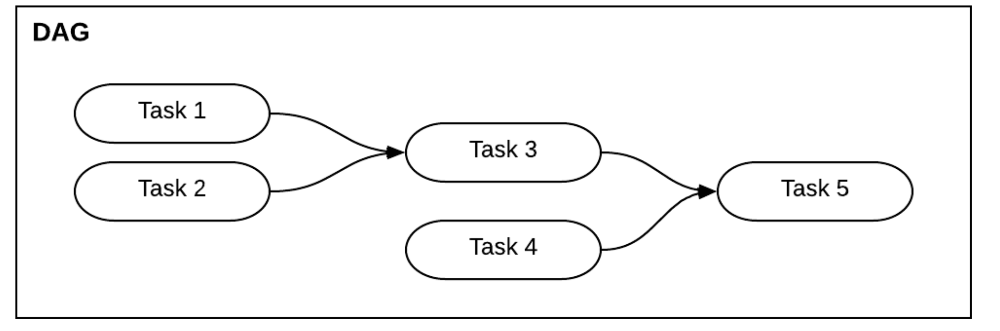
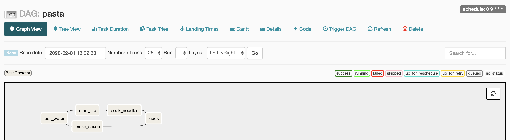

오늘은 Data Workflow Management Tool 중 하나인 *Airflow* 에 공부하고 정리한 것을 작성한다.

<br>

__Workflow Management Tool?__
===
__데이터 전처리, 학습, 배포, 예측__ 혹은 __데이터를 추출, 가공, 저장__ 하는 ETL(Extract, Transform, Load)등을 진행하다보면<br>
여러개의 일들이 연결되어 수행되는 경우가 빈번하게 있다.
여러개의 일들이 연결되어 수행 하는 동작하는 동작 흐름(Workflow)을 실행시키위해 배치 형태의 테스트를 실행 , 에러 분기에 따른 알림 , 재실행을 시켜주는 도구의 요구사항이 생기게 되었고,
이러한 이유들로 인해 Data Workflow를 편리하게 실행시키고 관리하는 자동화 도구(__ex) Airflow , Luigi , Digdag , Oozie__)들이 등장하게 되었다. 


__Airflow__
===
Airflow 는 Airbnb 에서 만든 Workflow Management Tool ,현재는 Apache 재단에서 인큐베이션을 진행하고 있다.<br><br>

__Airflow의 특징__<br>

- Java, Python를 지원하여 Workflow 를 코드로 표현이 가능하다고 하지만 Python으로 제일 많이 쓰이고 있음.
- DAG(Directed Acyclic Graph) 기반으로 Data Worflow 를 관리
- 강력한 웹 인터페이스를 제공하여 편리한 Workflow 관리가 가능 하다는 점이 존재한다.
<br><br>

__다른 Worflow management Tool과 비교했을때 내가 생각하는 장점__<br>

- 작업흐름(Workflow)를 코드로 정의하여 접근성과 유지보수가 좋다.
- 웹 콘솔을 지원하여 모니터링의 관점에도 좋다.
- Google composer로 쉽게 Airflow 를 설치 할 수 있어 GCP 혹은 클라우드를 이용하신다면 추천!
<br><br>


__DAG__
===
Airflow 는 DAG 기반으로 Workflow를 관리하고 있다.<br><br>

<br><br>

DAG(Directed Acyclic Graph)를 풀어보면<br>
방향성(directed) : 단방향으로 연결 , 따라서 단방향 화살표로 표시되어 있음<br>
비순환(acyclic) : 한번 지나간 노드는 다시 지나가지 않음, 최종적으로 엣지 없는 노드에 이르게 됨<br>
그래프(graph) : 노드와 엣지를 구성되는 구조  __(Task 1 : 노드 ,Task 1 과 Task 3 을 잇는 선 : 엣지)__<br><br>
따라서 작업간의 의존성 , 후 관계가 생기는 구조로 구성되어 있는것 이 DAG이고
위 내용을 Airflow 구조로 해석하면<br>
__노드: 작업(Task)<br>__
__TASK을 지원하는 형태: 연산자(Operator)__<br>
__노드들의 전체 흐름: DAG 로 표현한다.__<br>

DAG의 이해를 조금 더 돕고자 예시를 하나 들어 시작 해보고자한다.<br>
파스타 요리의 작업 흐름은 
다음과 같은 5가지의 TASK로 정의된다.<br>
__물을 끓인다, 불을 지핀다, 면을 익힌다, 소스를 만든다 , 면과 소스를 볶는다__<br>

그리고 이 작업 흐름은 다음과 같은 의존성 과 전후 관계가 존재한다.
1. 불이 없으면 물을 끓일수 없다
2. 물을 끓이지 않으면 면을 익힐 수 없다.
3. 면을 익히지는것과 소스 만드는 일은 동시에 진행이 가능하다

DAG를 Airflow Python script를 이용해 표현을 할 수 있다.

```python
from airflow import models
from airflow.operators.bash_operator import BashOperator
from datetime import datetime, timedelta

default_args = {
    'owner': 'byeongwoo',
    'depends_on_past': False,
    'start_date': datetime(2020, 2, 1), # start_date를 현재날자보다 과거로 설정하면, backfill(과거 데이터를 채워넣는 액션)이 진행
    'email': ['airflow@airflow.com'],
    'email_on_failure': False,
    'email_on_retry': False,
    'retries': 1,
    'retry_delay': timedelta(minutes=5) # 5분 기간으로 재시작 설정
}

# pasta dag 객체 생성
with models.DAG(
        dag_id='pasta',
        schedule_interval='0 9 * * *', # 매일 9시 0분에 동작하도록 설정
        default_args=default_args
) as dag:

    t1 = BashOperator(task_id='boil_water', bash_command='echo start fire', dag=dag)
    t2 = BashOperator(task_id='start_fire', bash_command='echo boil water', dag=dag)
    t3 = BashOperator(task_id='cook_noodles', bash_command='echo cook noodles', dag=dag)
    t4 = BashOperator(task_id='make_sauce', bash_command='echo make sauce', dag=dag)
    t5 = BashOperator(task_id='cook', bash_command='cook', dag=dag)

    t1 >> t2 >> t3 >> t5 # 불이 없으면 물을 끓일수 없다 , 물을 끓이지 않으면 면을 익힐 수 없다.
    t2 >> t4 >> t5 # 소스 만드는 일은 동시에 진행이 가능하다
    # set_upstream 으로도 표현이 가능 t1 작업이 끝나야 t2가 진행된다는 뜻
    # t2.set_upstream(t1) == t1.set_downstream(t2)는 동일한 표현
    # t1 >> t2 와 동일 표현
```
이 코드로 표현 된 DAG는 다음과 같이 표현된다.

<br><br>

__연산자__
===
연산자(Operator)는 각각의 작업을 정의하는 데 사용한다.Airflow 는 다음과 같은 기본 연산자 타입들을 제공하고 있다.
```shell script
BashOperator: Bash 명령 실행
PythonOperator: Python 함수 실행
EmailOperator: 이메일 전송
HTTPOperator: HTTP 요청 전송
MySqlOperator, SqliteOperator, PostgresOperator, MsSqlOperator, OracleOperator, JdbcOperator: SQL 명령 실행
Sensor: 특정 시간, 파일, DB 레코드, S3 키 등을 기다림
```
이 외에도 다양한 연산자가 존재하고 파라미터 값이 적용된 연산자의 오브젝트를 작업(task)이라 부릅니다.
위 파이썬 소스의 t1, t2, t3, t4는 모두 작업(Task)이고
각 작업은 반복되어 실행되어도 같은 결과를 도출하는 속성(idempotency)을 가져야 한다.
그리고 특정 시간에서의 작업과 DagRun 조합을 작업 인스턴스라 정의한다.
```python
task_instance = (task, dag_run, time)
```
작업 인스턴스는 반드시 상태(queued, running, success, failed, skipped, up for retry)를 나타내게 된다.
그리고 대부분의 작업흐름 시나리오에서 후행 Task 선행 Task 일부 정보를 사용해야 한다.<br>
따라서 태스크 인스턴스는 다른 프로세스, 또는 다른 머신에서 실행되기 때문에 Airflow는 이 목적으로 Xcom이라는 통신 메커니즘을 제공한다.

__마무리__
===
오놀 Airflow 에 대해 알아보고 기본개념인 DAG와 연산자(Operator), 작업(Task)에 작성해보았다.
막상 보면 정의된 일정으로 특정 작업을 수행한다는 기본 개념은 리눅스에서 제공되는 crontab과 유사하다.
하지만 Airflow는 crontab이 구현할 수 없는 GUI를 통해 DAG를 편리하게 관리/모니터링,타임아웃 재시도 등의 예외가 발생되었을 때 관리자에게 쉽게 보고, 타임아웃, 재시도 횟수, 우선도 등을 정의
등의 이점들이 있어 강력한 Workflowtool이라 생각한다.

다음에는 Airflow의 구조와 설치에 대해서 작성해보려고한다.