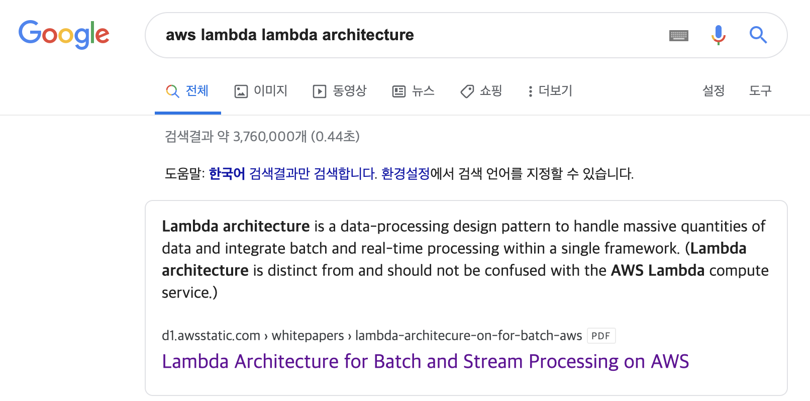
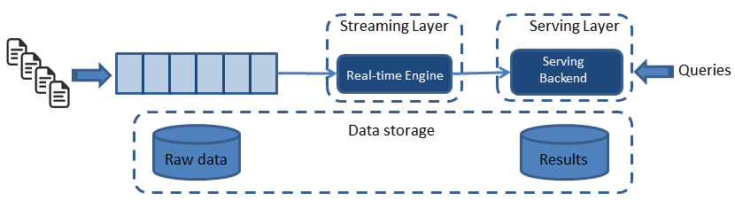
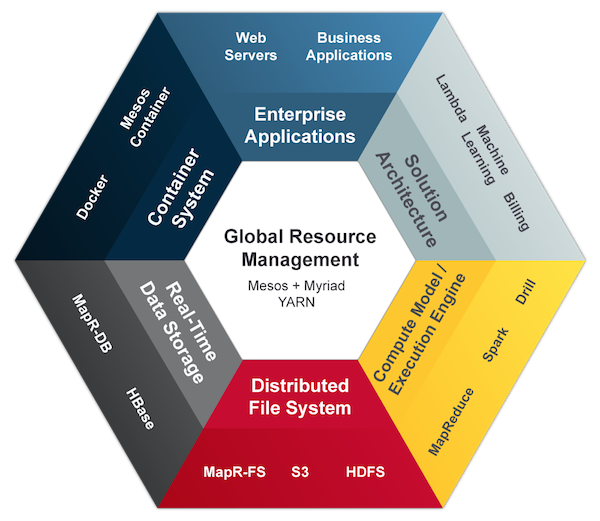

오늘은 실시간 분석을 지원하는 데이터 처리 아키텍쳐, 람다 아키텍쳐에 대해서 작성해보고자 한다. 

글을 작성하기에 앞서 AWS에서 제공하는 서버리스 컴퓨팅 서비스인 Lamdba와 관련이 없음을 이야기 하고자한다. 
~~사람들이 얼마나 검색했으면 AWS 문서에서도 혼동하지 말라는 메세지를 주고있다~~ 

# Lambda Architrcture?
트위터 개발자 Nathan Marz에 의해서 소개된 아키텍쳐로, 실시간 분석을 지원하는 대용량 데이터 처리 아키텍쳐이다.  
 
출처: [Lambda Architecture](http://lambda-architecture.net/) 
스피드레이어(Speed Layer),배치레이어(Batch Layer),서빙레이어(Serving Layer) 총 3개의 레이어로 구성되어 있다.

## Batch Layer

데이터를 처리하는 단위(분,일,월)로 데이터가 입력되면 해당 설정한 단위로 데이터 처리를 하는 레이어이다.
immutable한 데이터들에 대해서 배치 작업을 통해 결과 값을 저장하는데 배치 레이어의 대표적인 예로는 Hadoop,Spark,Hive 등이 존재한다.

## Speed Layer
실시간 데이터를 처리하고 응답시간을 빠르게 유지하는 역할을 하는 레이어이다.
스트림으로 들어온 데이터를 처리하기 위한 큐나 버퍼같은 구조를 사용하고 효율적 스트림처리를 위한 증분처리 방식을 사용하고
빠른 데이터 처리,지연시간을 최소화 하는것을 목표로 한다.
스피드 레이어의 대표적인 예로는 Apache Spark Streaming,Storm,Flink 이 존재한다.

## Serving Layer
배치레이어와 스피드레이어를 통해 처리된 배치뷰와 실시간뷰를 병합하여 사용자에게 데이터 조회를 제공해주는 레이어이다.
위 그림에서는 배치뷰만 데이터 조회를 하게끔 그려놨지만 실시간뷰와 배치뷰를 병합해서 보여주는 방법 일반적인 것 같다.
서빙 레이어의 대표적인 예로는 Druid,HBase등이 존재한다.

이렇게 람다 아키텍처를 이용하여 데이터 처리 아키텍처를 구성한다면 다음과 같은 항목들이 장단점이 될 수 있을것 같다.
- *장점*
    - 배치,실시간 으로 나뉘어져 있기때문에 모든 데이터를 처리하는 기존 데이터 처리방식보다 대용량 처리에 적합한 구조를 가진다.
    - 높은 확장성을 가진 구조이다.
    - Near-Real-Time으로 데이터 조회가 가능하다.
- 단점
    - 배치레이어와 스피드레이어의 분리로 인한 중복 데이터가 존재할 수 있다.  
    - 분리된 레이어에 대한 아키텍처 관리에 대한 복잡성이 증가 할 수 있다.

람다 아키텍처의 단점을 보안하기위해 나온 카파아키텍처도 존재한다.

_카파 아키텍처_
간단하게 설명하자면 람다 아키텍처에서 Batch Layer를 제외한 2가지 레이어로 구성된 아키텍처이다.  

_제타 아키텍처_
제타 아키텍처는 검색하다가 우연히 발견한 아키텍처인데 엔터프라이즈에서 데이터 아키텍처 구성 방법(?)이라는데 아직 잘 이해되지 않았다.

## 결론
오늘은 간단하게 람다 아키텍쳐에 대해서 작성해보았는데
람다 아키텍쳐는 대용량 처리를 위해 나온 아키텍처이지만 대용량 데이터 처리가 아니더라도 다양한 기술부문에서 적용할 수있는 개념인 것 같다.  
또한 다양한 회사에서 람다 아키텍처를 기반으로 데이터 파이프라인을 구성하고 있어 좋은 아키텍처라 생각하지만 용도에 맞게 적용하는것이 더 중요한 것 같다.
다음에 기회가 된다면 Spark를 이용하여 람다 아키텍처를 만드는 글을 써봐야겠다.    

참고 했던 자료들
- AWS Lambda Architecture : [공식문서](https://d1.awsstatic.com/whitepapers/lambda-architecure-on-for-batch-aws.pdf)
- Azure Data Architecture : [공식문서](https://docs.microsoft.com/ko-kr/azure/architecture/data-guide/big-data/)
- Serverless Lambda Architecture with Google Cloud Platform : [Medium](https://medium.com/@imrenagi/serverless-lambda-architecture-with-google-cloud-platform-35cb3123206b)
- Lambda Architecture  : [링크](http://lambda-architecture.net/)
- Lambda Architecture 위키피디아 : [링크](https://en.wikipedia.org/wiki/Lambda_architecture)