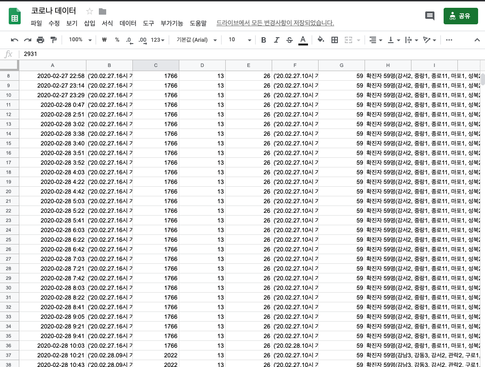
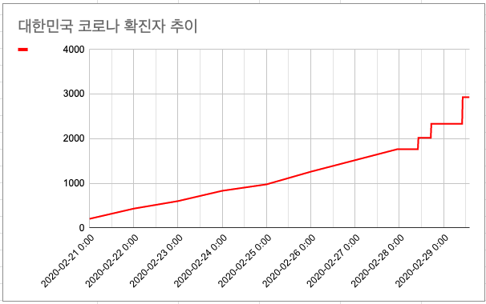

## 코로나로 인한 원격근무의 시작
이번 주에 코로나로 인해 2월 25일부터 원격근무를 집에서 진행되었는데 코로나가 얼마나 위험한지 잘 체감이 되지 않아 얼마나 위험한지 해당 그래프로 한눈에 보고 체감하고 싶었다.

## 어떻게 해야 데이터를 볼 수 있을까? 😮
낮에는 일하고 저녁에는 피곤할 것 같아 한두 시간을 쏟아 간단히 데이터를 모아 그래프 보고 싶었다. 그래서 코로나 관련 API가 있으면 받아올 수 있지 않을까?<br> 
라는 생각에 찾아봤지만 없었고 대신에 서울시에서 만든 [서울시 코로나19 상황판](http://seoul.go.kr/coronaV/coronaStatus.do?tab=1)을 보려고 했지만 내가 원하던 한눈에 볼 수 있는 추이 그래프는 없었다.<br>
그래서 내가 해당 상황판을 크롤링하여 그래프를 만들어 보기로 했다(~~다른 이유로는 간만에 크롤링 스크립트 작성을 해보고 싶었~~)
내가 원하는 요구사항은 세 가지였다.
1. 간단하게 만들 수 있고 돈이 안 들었으면 좋겠다.
2. 코로나 추이 그래프를 주기적으로 보고 싶었다
3. 데이터를 파싱해서 저장할 곳이 필요했다.

이 정도면 만들 수 있지 않을까 싶어 찾은 결과 *google spreadsheet, github action, python* 이 세 가지를 이용하기로 하였다.<br>
선택했던 이유는 1, 2, 3번의 요구사항을 충분히 충족시켜줬다.

* github action -> schedule 기능이 있어 주기적으로 동작 가능 및 코드 공개 시 github action은 무료 ⭐️
* python -> 간단하게 만들기 쉬움
* google spreadsheet -> API를 제공해서 코드상에서 데이터를 적재 할 수 있 또한 엑셀을 이용해 그래프 생성 가능.

## 크롤링
크롤링 흐름은 다음과 같이 설정하였다.
1. [서울시 코로나19 상황판](http://seoul.go.kr/coronaV/coronaStatus.do?tab=1)에 확진자, 사망자 데이터를 파싱
2. 파싱한 데이터를 html 태그 제거
3. 파싱한 데이터를 google spreadsheet에 전송

원래 목적이였던 데이터 파싱을 위해 최대한 간단하게 flow를 그렸다.

## GitHub Action 설정
gitHub action은 GitHub이 제공하는 CI/CD 솔루션이다. 
gitHub action 워크플로우는 .github/workflows 폴더에 <action name>.yaml 파일을 통해 설정할 수 있다.

```yaml
name: corona data cralwering
on:
  push:
    branches:
      - master
  schedule:
    - cron: "*/20 * * * *"
jobs:
  fetch:
    name: Fetch
    runs-on: ubuntu-latest
    steps:
      - uses: actions/checkout@v2
      - name: Set up Python 3.8
        uses: actions/setup-python@v1
        with:
          python-version: 3.8
      - name: Install dependencies
        run: |
          python -m pip install --upgrade pip
          pip install -r requirements.txt
      - name: crawling
        run: |
          echo $GOOGLE_CREDENTIALS > credentials.json
          python -m cralwer
        env:
          GOOGLE_CREDENTIALS: github secret값
          SPREADSHEET_URL: github secret값
```
해당 cron은 20분마다 동작하게 설정 후 python, python package를 설치 후 동작하는 action이다. google 관련 API를 사용하기 위해 credentials를 사용하려고 환경 변수로 설정하려고 했으나 해당 부분에서 어려움을 겪었다.어떤 어려움이였다면 github secret를 통해 credentials의 값을 주입하여 사용하려고 했으나 코드에서 자꾸 JSON을 string으로 읽어서 에러가 발생했고 이를 해결하기위해 action 안에서 echo credential을 통해 호출된 값을 내부 JSON 파일로 저장하여 코드에서 호출하니까 동작하게 되었는데 좋은 방법 같지는 않아 검색을 여러 가지 했으나 마땅한 해결방법을 찾지 못 한 상태이다.(혹시나 이 글을 읽고 계신 독자분께서 해당 환경 변수 해결법을 아시는 분이라면 댓글 환영 🤲)
하여튼 돌고 돌아 우여곡절 끝에 해당 동작하는 것을 완료하였고 아래와 같은 결과물들을 얻을 수 있었다.

#### 서울 코로나 데이터 저장 결과


#### 대한민국 코로나 확진자 추이 그래프


## 마치며
내가 원하던 대로 데이터를 읽고 분류하고 저장하여 데이터를 볼 수있어서 짧은 시간을 투여했지만 재밌었다. 또한 코로나 데이터를 읽어서 주기적으로 읽고는 있지만 해당 소스코드를 고치면 github action을 이용한 ~ 주기적으로 크롤링 데이터 적재하기등에 사용할 수 있을 것 같다. 그리고 그래프를 직접 그려보니 코로나가 점점 폭발적으로 확산되고 있는데 **다들 몸 조심하시고 마스크 꼭 끼시길 바랍니다**

> [사용한 소스코드](http://github.com/bomwo/corona19) ~~20분 만에 만든 코드라 상당히 코드가 어지럽습니다.~~