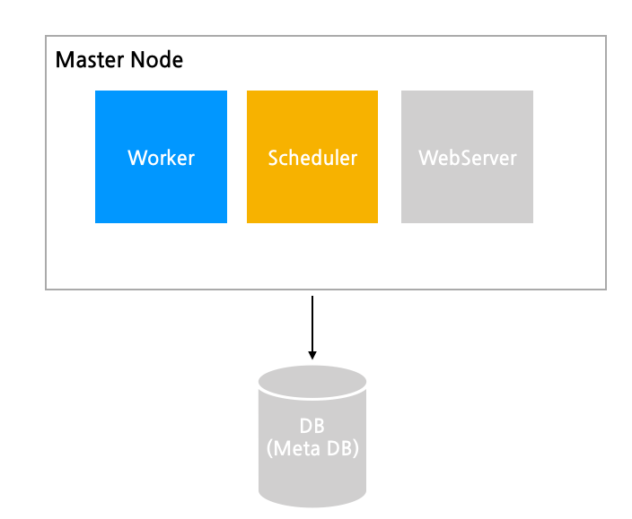
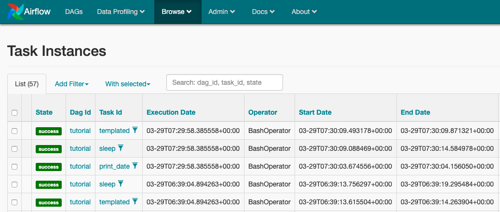

# 들어가기
저번 포스트였던 **[Airflow란?](https://bomwo.github.io/airflow/)**에 간단하게 airflow의 개념들에 대해서 작성해보았다.
오늘은 airflow를 구조에 대해 파악과 docker를 이용해 간단하게 설치 후 execution_date이 무엇이고 어떤 식으로 사용할 수 있는지 작성해 보려고 한다.

## airflow architecture


master node 안에 크게 webserver, scheduler, executor로 크게 3가지로 구성되어 있다.
### airflow webserver
workflow(DAG)의 실행, 재시작, 로그, 코드 등을 모두 Web server UI로 관리가 가능하다.
### airflow scheduler
작업 기준이 충족되는지 여부를 확인 종속 작업이 성공적으로 완료되었고, 예약 간격이 주어지면 실행할 수 있는 작업인지, 실행 조건이 충족되는지 등
위 충족 여부가 DB에 기록되면, task들이 worker에게 선택서 작업을 실행한다.
DB는 기본으로 sqlite를 제공하고 있고 다만 **sqlite는 동시 접근이 제어되어 DAG가 병렬처리되지 않고 순차처리**가 된다고 하여 Production에서 사용할 용도라면 
postgresql, mysql 등 데이터베이스를 사용하는 것을 추천한다.
### airflow executor
executor는 worker로도 불리며 각 환경에 따라 여러 가지 executor를 제공하고 있다.
#### sequentialexector(default)
task 순차 처리 / sqlite3를 backend로 설정 / test로 사용 권장
#### localexecutor
task 병렬 처리 가능 / mysql이나 postgresql을 backend로 설정 / task마다 subprocess를 생성한다.
#### celeryexecutor
task를 여러 서버(node)에 분산 처리 가능 (cluster) / celery backend (rabbitmq, redis, …) 설정이 필요하다.
#### daskexecutor
celery와 같은 역할이지만 Dask로 처리한다.
#### kubernetesexecutor
kubernetes로 cluster 자원을 효율적으로 관리 가능 / airflow 1.10 버전부터 지원하고 있다.

### 설치 방법
**[apache/airflow](https://github.com/apache/airflow)**를 docker images 만든로 **[오픈소스](https://github.com/puckel/docker-airflow)**를 이용하여 간단하게 로컬에서 동작 시킨다.
#### 명령어
```shell script
git clone https://github.com/puckel/docker-airflow
cd docker-airflow
docker pull puckel/docker-airflow 
docker-compose -f docker-compose-LocalExecutor.yml up -d 
```
그러면 **[localhost:8080](http://localhost:8080)**를 통해 airflow web ui에 접속이 가능하다.
### 의문점

🤔<br>
나는 airflow에서 DAG를 동작시키고 task instance를 보던 도중 execution_date, start_date, end_date을 보게되었는데
start_date, end_date는 현재 DAG의 동작시킨 시작, 종료의 값과 동일하여 이해했는데 execution_date는 다른 시간과 달라 찾아보았다.
### execution_date?
execution_date는 airflow는 번역 그대로 DAG를 실행할때의 동작시간,실행 시간을 의미한다고 한다. 나는 실행 시간과는 별개로 독자적인 DAG의 crontab 실행시점으로 이해하였다. 
그리고 airflow는 기본적으로 UTC로 동작하기 때문에 동작 시간 자체를 한국시간으로 설정하지 않는 이상 execution_date의 설정을 많은 분들이 어려워 하시는것 같다.~~(나 또한..)~~<br>
execution_date는 airflow는 flask에서 자주 사용하는 jinja template을 지원한다.
직접적으로 execution_date를 호출할 수 있고 ds,macros로도 호출이 가능하다.
그리고 다음과 같은 DAG 예시로 직접 값의 로그를 찍어보았다.
```python
templated_command = """
        echo "{{ ds }}"
        echo "{{ execution_date }}" 
        echo "{{ macros.ds_add(ds, 2)}}"
        echo "{{ params.my_param }}"
"""

t3 = BashOperator(
    task_id="templated",
    bash_command=templated_command,
    params={"my_param": "Parameter I passed in"},
    dag=dag,
)
```
```shell script
[2020-03-29 07:30:09,837] {{bash_operator.py:105}} INFO - Temporary script location: /tmp/airflowtmpu7n6m2et/templated37eeblxe
[2020-03-29 07:30:09,837] {{bash_operator.py:115}} INFO - Running command: 
        echo "2020-03-29"
        echo "2020-03-29T07:29:58.385558+00:00" 
        echo "2020-03-31"
        echo "Parameter I passed in"
[2020-03-29 07:30:09,844] {{bash_operator.py:122}} INFO - Output:
[2020-03-29 07:30:09,846] {{bash_operator.py:126}} INFO - 2020-03-29
[2020-03-29 07:30:09,846] {{bash_operator.py:126}} INFO - 2020-03-29T07:29:58.385558+00:00
[2020-03-29 07:30:09,846] {{bash_operator.py:126}} INFO - 2020-03-31
[2020-03-29 07:30:09,846] {{bash_operator.py:126}} INFO - Parameter I passed in
[2020-03-29 07:30:09,846] {{bash_operator.py:130}} INFO - Command exited with return code 0
[2020-03-29 07:30:09,871] {{taskinstance.py:1048}} INFO - Marking task as SUCCESS.dag_id=tutorial, task_id=templated, execution_date=20200329T072958, start_date=20200329T073009, end_date=20200329T073009
```
29일 동작시킨 시점에서는 ds, macros, execution_date 의 로그를 보며 값을 확인할 수 있었다. **[공식문서](https://airflow.apache.org/docs/stable/macros.html)**에 다양한 문법을 지원해 DAG의 동작시점에 잘 표현한 값이라 생각하였다.
#### 왜 execution_date가 필요한 것일까?
회사에서도 많이 느꼈지만 다른 데이터 엔지니어링 블로그 글들을 보며 pipeline의 실패나 혹은 데이터 재처리를 할 경우가 종종 발생한다.
이 경우 과거 데이터를 재처리 시켜주는 명령인 backfill을 진행할때가 있는데 pipeline이 실행했던 시점의 데이터와 날짜를 넣어야 하다보니 execution_date를 날짜 변수값으로 이용해 꼭 필요한 값이라 생각한다.

#### 다른 유의 사항이 있을까?
위에서도 언급은 하긴했지만 UTC를 고려한 execution_date의 시간 계산을 해야한다. 우리는 한국에 있기 UTC+9된 시간을 execution_date 에 적용 해야 할 것 이다. 

##### 마무리
airflow를 구조에 대해 파악과 docker를 이용해 간단하게 설치 후 execution_date이 무엇이고 어떤 식으로 사용할 수 있는지 작성해 보았는데 나는 이중에서 airflow를 kubernetes에 올려
kubernetesexecutor를 사용해보는 구조를 좀 더 경험해 보고싶어 그 부분에 대해 경험이 되는대로 포스트 작성 해보고싶다.

##### 출처
1. [airflow의 스케줄링과 execution_date의 의미](https://blog.naver.com/gyrbsdl18/221561318823)<br>
2. [Why Apache Airflow Is a Great Choice for Managing Data Pipelines](https://towardsdatascience.com/why-apache-airflow-is-a-great-choice-for-managing-data-pipelines-48effcce3e41)