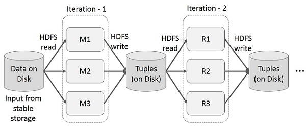
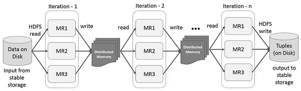

# RDD
RDD는 Resilient Distributed Dataset 의 줄임말로 스파크의 기본 데이터 구조이다. 분산 변경 불가능한 객체 모음이며 스파크의 모든 작업은 새로운 RDD를 만들거나 존재하는 RDD를 변형하거나 결과 계산을 위해 RDD에서 연산하는 것을 표현하고 있다.
스파크는 빠른 map reduce 작업을 RDD 개념을 이용해 사용한다고 한다. 그렇다면 여기서 궁금한 점은 기존 대용량 데이터 처리 프레임워크인 hadoop에서 사용하던 map reduce의 어떤 단점들이 존재하여 spark rdd로 넘어오게 되었을까에 대한 내용들이 였다.

### 파일 시스템을 이용한 map reduce는 데이터 공유가 느리다.
Map reduce을 진행할 때 기존의 모든 프레임워크에서는 계산된 데이터를 재사용하기 위해 파일 스토리지 시스템에 저장하고 읽는 구조로 되어 있다.
복제, 직렬화, 디스크 io 때문에 데이터 공유가 느려진다. 대표적으로 hadoop의 시스템의 대부분은 hdfs 읽기 쓰기 작업을 수행하는데 90% 이상을 사용하고 있다고 한다

### map reduce의 반복연산
 
위 그림과 같이 map - reduce 단계마다 중간 결과를 재사용 한다. 이로 인해서 데이터 복제,디스크 i/o 직렬화로 인한 오버헤드 발생으로 시스템 속도가 느려진다.

### 스파크 RDD를 이용한 데이터 공유

스파크의 핵심 아이디어는 RDD(Resilient Distributed Dataset)이며, 메모리 내 처리 연산을 지원한다. 메모리에서 데이터 공유는 네트워크나 디스크보다 10~100배 빠르다.
다만 데이터를 램에 올린 이후에 fault-tolerant가 발생해도 문제가 없도록 memory 내용을 갱신하지 않고 *read-only*로 사용한 것이 RDD이다. RDD를 사용했을 때 기존 map reduce 파일 시스템과 비교했을 때 장점들을 알아보도록 하자.

### RDD를 사용한 반복(iterative) 연산
 
위 구조에서 동일하지만 hdfs에 접근하는게 아닌 memory에 보관하여 실행시간을 줄여준다.

#### 정리
spark에 대해 아직도 잘 모르는 부분이 많다고 생각이 들어 간단하게 spark rdd에 대한 내용을 읽고 정리하였다.
다음에는 spark 가 왜 lazy execution으로 동작하고 action, transformation에 대해서 공부하고 실제로 rdd로 간단한 예제를 동작시켜보고자 한다.
 
##### 공부에 도움이 됬던 링크들
[*tutorialspoint*](https://www.tutorialspoint.com/apache_spark/apache_spark_rdd.html) 
[*RDD 논문*](http://citeseerx.ist.psu.edu/viewdoc/download?doi=10.1.1.420.2218&rep=rep1&type=pdf)
