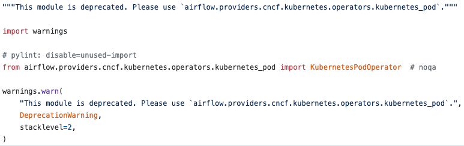

### 들어가며 

Airflow 2.0의 출시가 임박하게 되면서(현재는 2.0 베타가 나온 상태) Airflow를 Kubernetes 환경에서 사용하기 위해
KubernetesExecutor, helm chart의 변경 등 배포 및 운영을 좀 더 원활히 할 수 있는 다양한 지원들이 나오고 있습니다.
이 글은 Airflow를 Kuberentes에서 사용하기 위한 다양한 지원들 중 [KubernetesPodOperator](https://github.com/apache/airflow/blob/master/airflow/providers/cncf/kubernetes/operators/kubernetes_pod.py) 에 대한 내용을 작성해보려고합니다.

# KubernetesPodoperator
KubernetesPodOperator는 어떤 언어 상관없이 Dockerfile로 작성된 빌드 된 image를 실행하도록 구축된 operator입니다. 


KubernetesPodoperator를 사용하려면 다음과 같은 환경이 먼저 구성되어 있어야합니다.
- Airflow가 Kubernetes 환경에 구축되어 있어야합니다.
- Airflow version 이 1.10.X 이상


### 1.10.12 version 사용 시 유의 사항
만약 KubernetesPodoperator의 모듈을 ```airflow.contrib.operatos.Kubernetes_pod_operator```를 사용하고 계시다면 코드 업데이트가 필요합니다.
Airflow가 2.0으로 버전이 올라가게 되면서 contrib의 모듈을 지원하지않고 기존 모듈들을 provider로 옮겨간 상태입니다.


따라서 모듈 업데이트가 필요합니다. 허나 CNCF 모듈은 2.0에는 패키지가 추가된 상태여서 별도의 설치가 필요없이 모듈을 호출해서 사용할 수 있으나 1.10.12에는 
kuberentes 패키지를 사용하기 위해 [back-port-providers-cncf-kuberentes-package](https://pypi.org/project/apache-airflow-backport-providers-cncf-kubernetes/)를 
직접 설치 혹은 Docker를 이용해 Airflow를 사용중이시라면 image에 해당 패키지를 추가하는 작업을 통해서 사용이 가능합니다 또한 Python3.6 이상만 지원이 되니 사용시 유의바랍니다!