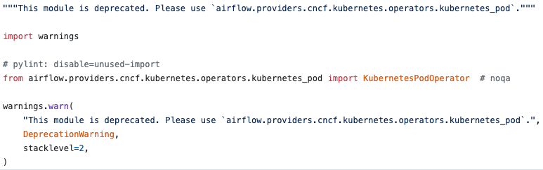

### 들어가며 

Airflow 2.0의 출시가 임박하게 되면서(현재는 2.0 베타가 나온 상태) Airflow를 Kubernetes 환경에서 사용하기 위해
KubernetesExecutor, helm chart의 변경 등 배포 및 운영을 좀 더 원활히 할 수 있는 다양한 지원들이 나오고 있습니다.
이 글을 통해 Airflow를 Kuberentes에서 사용하기 위한 다양한 지원들 중 [KubernetesPodOperator](https://github.com/apache/airflow/blob/master/airflow/providers/cncf/kubernetes/operators/kubernetes_pod.py) 에 대해 작성해보려고합니다.


## KubernetesPodoperator
KubernetesPodOperator는 어떤 언어 상관없이 Dockerfile로 작성된 빌드 된 image를 airflow에서 kubernetes Python client를 호출하여 docker image를 컨테이너로 실행시켜주는 operator입니다.
비슷하게 Airflow에서 Docker image를 동작 시킬 수 있는 Docker operator가 존재하지만 Airflow가 구성된 환경에 docker가 설치되어 있어야 하는 제약과 단일 환경에서 컨테이너로 동작하는 docker operator 보다
orchestration tool 인 kubernetes 환경에서 Docker image를 동작시킬 수 있는 kuberentes pod operator가 작업을 병렬화하고 종속성에 따라 적절하게 예약하고 필요할 때 데이터를 기록적으로 재 처리
할 수 있는 airflow 에서 찰떡 궁합인 operator라고 생각합니다.

### 세팅하기
KubernetesPodoperator를 사용하려면 다음과 같은 환경이 먼저 구성되어 있어야합니다.
- Airflow가 Kubernetes 환경에 구축되어 있어야합니다.
- Airflow version 이 1.10.X 이상

### Kubneretes pod operator 작성하기
아래 DAG은 Kubernetes에서 pod operator의 작동 방식을 보여주기 위해 작성한 간단한 예시입니다.
```python
from datetime import datetime, timedelta

from kubernetes.client import models as k8s
from airflow.models import DAG, Variable
from airflow.operators.dummy_operator import DummyOperator
from airflow.kubernetes.secret import Secret
from airflow.kubernetes.pod import Resources
from airflow.providers.cncf.kubernetes.operators.kubernetes_pod import (
    KubernetesPodOperator,
)

dag_id = 'kubernetes-dag'

task_default_args = {
    'owner': 'bomwo',
    'retries': 3,
    'retry_delay': timedelta(minutes=5),
    'start_date': datetime(2020, 11, 21),
    'depends_on_past': False,
    'email': ['bomwo25@mgmail.com'],
    'email_on_retry': False,
    'email_on_failure': True,
    'execution_timeout': timedelta(hours=1)
}

dag = DAG(
    dag_id=dag_id,
    description='kubernetes pod operator',
    default_args=task_default_args,
    schedule_interval='5 16 * * *',
    max_active_runs=1
)

env = Secret(
    'env',
    'TEST',
    'test_env',
    'TEST',
)

pod_resources = Resources()
pod_resources.request_cpu = '1000m'
pod_resources.request_memory = '2048Mi'
pod_resources.limit_cpu = '2000m'
pod_resources.limit_memory = '4096Mi'


configmaps = [
    k8s.V1EnvFromSource(config_map_ref=k8s.V1ConfigMapEnvSource(name='secret')),
]

start = DummyOperator(task_id="start", dag=dag)

run = KubernetesPodOperator(
    task_id="kubernetespodoperator",
    namespace='development',
    image='test/image',
    secrets=[
        google_env,
        googleanaytics_env,

    ],
    image_pull_secrets=[k8s.V1LocalObjectReference('image_credential')],
    name="job",
    is_delete_operator_pod=True,
    get_logs=True,
    resources=pod_resources,
    env_from=configmaps,
    dag=dag,
)

start >> run
```

### Pod operator 설정 살펴보기
```python
configmaps = [
    k8s.V1EnvFromSource(config_map_ref=k8s.V1ConfigMapEnvSource(name='secret')),
]

Secret = Secret(
    'env',
    'Secret',
    'env2',
    'Secret',
)

secrets=[
        google_env,
        googleanaytics_env,

    ],
env_from=configmaps

```
Dockerfile에서 환경 변수로 설정된 값을 Kubernetes configmap 혹은 secret를 통해 설정된 값을 가져오려면 위와 같이 설정이 필요합니다. 만약 위와 같이 설정하지않는다면 환경변수로 설정된 값을 호출할 수 없습니다. 

```python
image_pull_secrets=[k8s.V1LocalObjectReference('image_credential')],
``` 
또한 Public으로 설정된 Docker image가 아닌 Private한 docker image를 가져오시려면 image_pull을 할수있는 환경변수를 호출를 통해 private image를 가져와 container로 동작시킬 수 있습니다.
```python
is_delete_operator_pod=True,
get_logs=True,
```
Airflow 환경에서 Pod의 동작하는 로그를 보고 싶다면 get_logs 를 true로 설정해야합니다. 그리고 is_delete_operator_pod를 true로 설정하지 않는다면 Pod operator가 동작하고 pod이 삭제되지 않아서 리소스를 잡아먹을 수 있습니다. 따라서 is_delete_operator_pod를 true로 설정하시는 것을 추천드립니다.
```python
pod_resources = Resources()
pod_resources.request_cpu = '1000m'
pod_resources.request_memory = '2048Mi'
pod_resources.limit_cpu = '2000m'
pod_resources.limit_memory = '4096Mi'                                     
```
pod에서 사용할 수 있는 resource가 한정되어 있다면 아래와 같이 resource의 request,limit을 정의할 수 있습니다.
```python
executor_config={
    "KubernetesExecutor": {
        "limit_cpu": "8",
        "limit_memory": "64Gi",
        "request_cpu": "4",
        "request_memory": "32Gi",
    }
}
```
위에 resource로 설정을 할 수도 있고 Kubernetes executor를 사용하고 있는 환경이라면 pod argument에 아래와 같이 executor의 리소스를 정의할 수 있습니다.

### Airflow 1.10.12 version 사용 시 유의 사항
KubernetesPodoperator의 모듈을 ```airflow.contrib.operatos.Kubernetes_pod_operator```를 사용하고 계시다면 코드 업데이트가 필요합니다.
Airflow가 2.0으로 버전이 올라가게 되면서 contrib의 모듈을 지원하지않고 기존 모듈들을 provider로 옮겨간 상태입니다.


따라서 모듈 업데이트가 필요합니다. 허나 CNCF 모듈은 2.0에는 패키지가 추가된 상태여서 별도의 설치가 필요없이 모듈을 호출해서 사용할 수 있으나 1.10.12에는 
kuberentes 패키지를 사용하기 위해 [back-port-providers-cncf-kuberentes-package](https://pypi.org/project/apache-airflow-backport-providers-cncf-kubernetes/)를 
직접 설치 혹은 Docker를 이용해 Airflow를 사용중이시라면 image에 해당 패키지를 추가하는 작업을 통해서 사용이 가능합니다 또한 Python3.6 이상만 지원이 되니 사용시 유의바랍니다!

### 정리하기
kubernetespodoperator이 무엇이고 어떻게 작성하고 필요한 구성들에 대해서 작성해보았습니다. 작성을 하다보니 Kubernetes에서 제공하는 cronjob과 동일한 기능으로 보일 수 있지만 DAG으로 표현할 수 있어 데이터 처리 과정이나 동작 관리에 대해서
cronjob의 기능보다 효율적으로 관리 할 수 있을 것 같은 기능이고 Airflow와 kubernetes가 구성되어있고 cronjob을 사용하고 계시다면 사용해 볼 수있는 operator라고 생각합니다. 다음에는 Airflow 2.0이 나오게 된다면 2.0이 어떻게 바뀌었는지에 대한 글을 작성해보려고합니다. 읽어 주셔서 감사합니다!