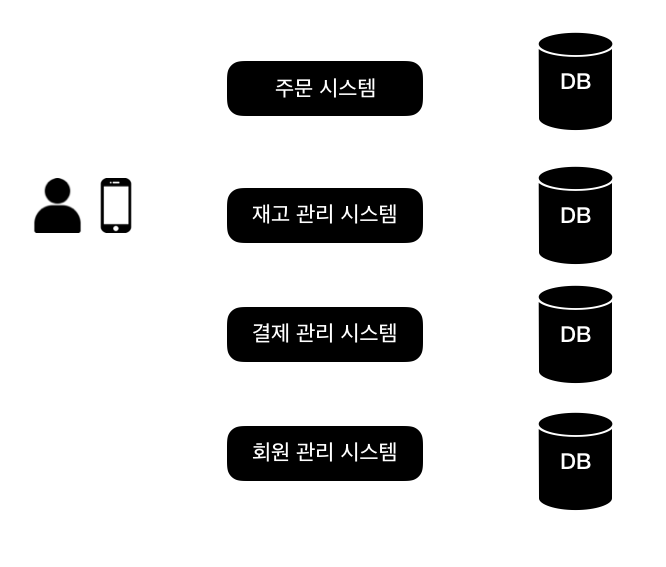
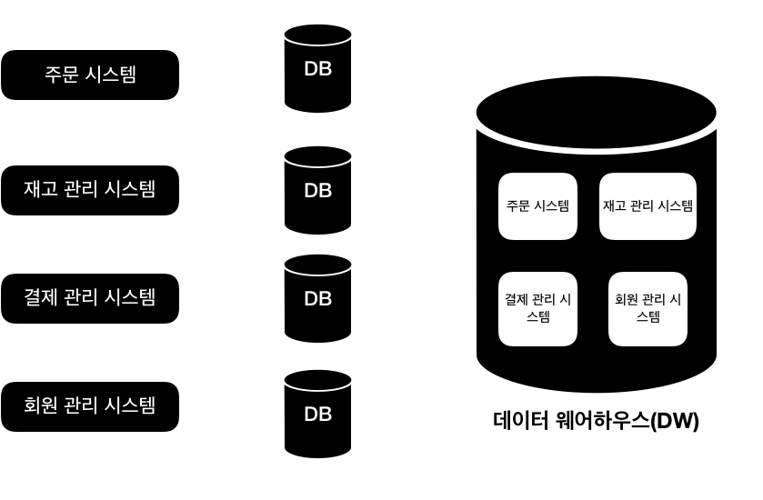
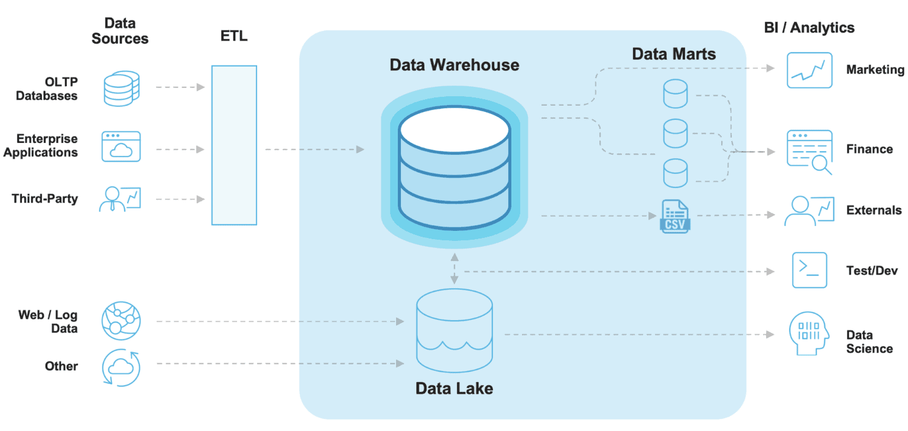

## 들어가며 
데이터 엔지니어로 일을 하면서 데이터 웨어하우스 모델링에 관심이 커져서 데이터 웨어하우스 모델링의 성서라 불리는 **랄프 킴벌의 데이터 웨어하우스 툴킷** 책을 구매하였습니다. 책이 써진 지는 약 20년 정도 더 넘었는데
데이터 웨어하우스를 왜 만들고 데이터 웨어하우스 모델링 기법에 대한 내용이 잘 설명되어있어서 해당 책을 읽고 정리하고자 합니다. 오늘은 책을 읽기 전 데이터 웨어하우스가 무엇이고
데이터 웨어하우스가 왜 필요해서 구축하는가에 대해서 작성해보려고 합니다.

### 데이터 웨어하우스 (DW)
> 데이터 웨어하우스(data warehouse)란 사용자의 의사 결정에 도움을 주기 위하여, 기간시스템의 데이터베이스에 축적된 데이터를 공통의 형식으로 변환해서 관리하는 데이터베이스를 말한다. 줄여서 DW로도 불린다.

라고 사전에 정의되어있습니다. 정리하면 사용자 의사결정에 필요한 데이터가 들어가 있는 데이터베이스라고 말 할 수 있습니다.
그렇다면 데이터 웨어하우스를 구축하지 않고 시스템의 데이터베이스에 직접 데이터 접근해서 분석을 하면 되지 않을까? 라는 궁금증이 들 수 있을 것 같은데
시스템의 데이터베이스를 통해 분석이 어려운 예시를 들겠습니다.

만약 쇼핑을 할 수 있는 앱이 있다면 간단하게 아래와 같은 시스템이 있고 각 시스템에 맞게 데이터들이 데이터베이스에 쌓일 것입니다. 
1. 결제 관리 시스템 : 사용자가 쇼핑을 하고 결제를 관리 하는 시스템 (사용자 결제 목록, 결제 내역)
2. 재고 관리 시스템 : 현재 옷의 재고를 보고 수량을 관리하는 시스템 (현재 재고수량, 부족한 재고 수량)
3. 주문 관리 시스템 : 쇼핑 주문는 하는 시스템 (주문 내역) 
4. 회원 관리 시스템 : 쇼핑몰 가입하거나 탈퇴하는 관리하는 시스템 (사용자 나이,성별,주소,유저 id)

네 개의 시스템은 각자의 목적에 맞게 역할이 있고 역할에 맞게 데이터베이스에 데이터를 저장할 것입니다.
만약 6개월 기간 동안 회원들의 어떤 품목을 얼마나 주문했는지를 알고 싶다면 회원 시스템 + 주문 관리 시스템의   
데이터베이스에 쿼리를 작성해서 데이터 분석을 할 수 있을 것입니다. 하지만 운영 시스템에 쿼리(SELECT,JOIN)를 기간으로 작성하게 된다면
시스템에 부하가 발생하게 되어서 앱이 동작하지 않게 되거나 데이터베이스를 분석하는 동안 사용하지 못하게 됩니다.
시스템의 데이터베이스는 데이터를 작은 규모의 데이터를 조회, 삽입, 삭제, 수정을 빠르게 하기 위해 만들어진 시스템이라서 큰 규모의 데이터 조회를 했을 때에는 부하가 발생하게 됩니다.

따라서 이런 부하를 발생시키지않고 운영 DB를 추출하여 큰 규모의 데이터 조회 및 분석을 위해 만들어 진 것이 데이터 웨어하우스입니다.

### 데이터 웨어하우스의 목적
- 데이터를 기반한 의사 결정이 가능
- 여러 소스의 데이터를 통합해서 분석이 가능
- 과거 데이터 분석
- 기존 정보를 활용해 더 나은 정보를 제공한다. 

### 데이터 웨어하우스의 아키텍쳐

데이터 웨어하우스의 아키텍쳐라고하면 위 그림과 같이 많은 기업들에서 위 형태로 구축을 하고 있습니다. 구축을 하면서 다양한 용어에 대해 정리하려고합니다.

ETL(Extract, Transform, Load)
ETL이란 데이터 웨어하우스 구축 시 데이터를 운영 시스템에서 추출하여 가공(변환, 정제)한 후 데이터 웨어하우스(DW)에 적재하는 과정을 말합다. 일반적으로 발생하는 데이터 변환에는 필터링, 정렬, 집계, 데이터 조인, 데이터 정리, 중복 제거 및 데이터 유효성 검사 등의 다양한 작업이 포함된다.

- Extract: 하나 또는 그 이상의 데이터 원천들로 부터 데이터 추출
- Transform: 추출한 데이터를 요구사항에 맞게 변경하는 작업
- Load: 변형 단계의 처리가 완료된 데이터를 특정 목표 시스템에 적재

데이터 레이크(Data Lake)는 정형, 반정형 및 비정형 데이터를 비롯한 모든 가공되지 않은 다양한 종류의 데이터를 한 곳에 모아둔 중앙 리포지토리. 빅데이터를 효율적으로 분석하고 사용하고자 다양한 영역의 Raw 데이터를 한 곳에 모아서 관리하고자 하는 목적이다.
데이터 마트(Data Mart)는 금융, 마케팅 또는 영업과 같은 특정 팀 또는 사업 단위의 요구를 충족시키는 데이터 웨어하우스이다. 규모가 더 작고, 집중적이며 사용자 커뮤니티에 가장 잘 맞는 데이터 요약을 포함할 수 있다. 데이터 마트는 데이터 웨어하우스의 일부일 수 있습니다.

### 마무리
오늘은 데이터 웨어하우스가 무엇이고 왜 필요한지에 대해서 작성해보았습니다. 글을 작성하면 할수록 데이터 웨어하우스를 구축할 때 여러 고려사항이 있어 신경을 많이 써야 하고
구축을 위해 모델링이 정말 중요하다고 생각했고 다음엔 책을 읽어가면서 데이터 웨어하우스 모델링에 대해서 더 작성해볼 예정입니다.

#### 출처
- [beyond-modern-data-architecture](https://www.snowflake.com/blog/beyond-modern-data-architecture/)
