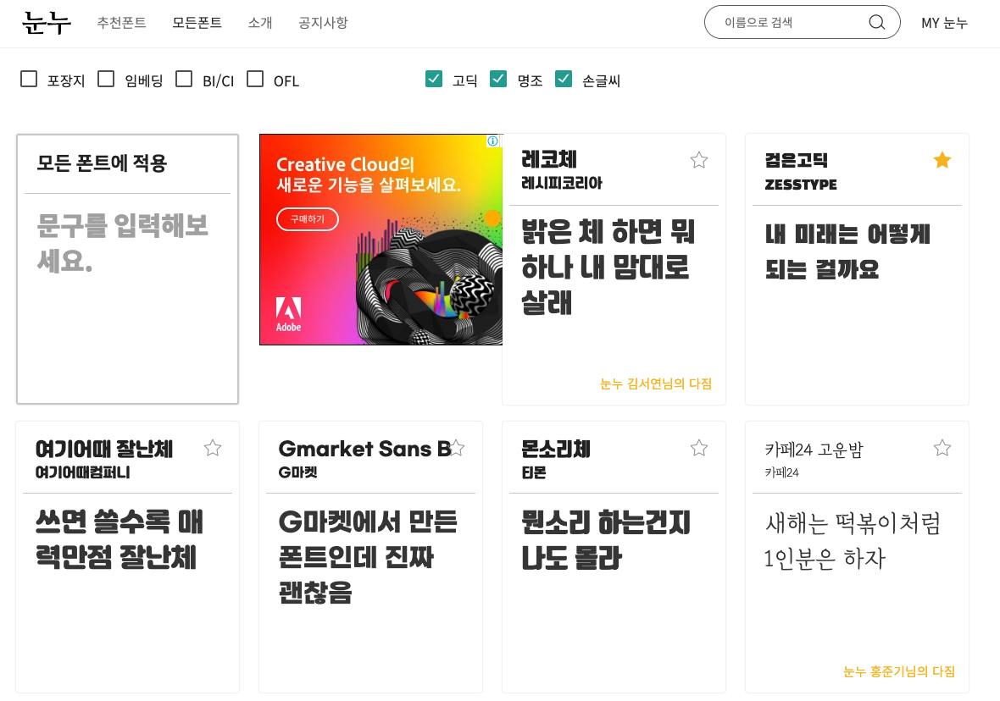

많은 일들이 있었던 2020년에 무슨일이 있었는지 회고하며 블로그에 작성해보려고 한다. 

### 사이드 프로젝트
 
나는 2년동안 사람들에게 상업용 무료한글 폰트를 모아 제공하고 있는 [눈누](https://noonnu.cc)에 서버 개발을 담당하는 팀원이었다. 
처음에는 아이디어가 참신하고 사이드 프로젝트를 경험해보고 싶어서 참여했던것이 어느새 2년이 지나가 버렸고 내가 생각하기에 아이디어가 참신했던 프로젝트는
월 20~30 만명의 사람들이 찾아 방문해주시는 조금 거대한 프로젝트가 되어버렸다.😮 
작년 2020년도에는 욕심이 생겨 혼자 공부하고 싶은 것들을 진행해보자라는 생각에 평일에는 일을하고 주말에는 사이드 프로젝트, 공부와 같이 병행하다가
가는 토끼 잡으려다가 잡은 토끼 놓친다라는 속담 처럼 공부, 체력을 얻지못하고 잘하고있던 프로젝트에도 영향이 있었다. 
왜 아무것도 잡지 못했을까 라고 생각해봤었을때 여러개를 동시에 하다보니 흐지부지가 되어서 아무것도 하지 못하게 되었고 나는 여러개보다 하나를 집중할 수 있도록 2021년도에는 프로젝트를 떠나는 선택을 하게되었다 
2년동안 애정을 갖고 진행했던 프로젝트지만 내가 하고싶고 이루고 싶은것을 위해 선택하게 되었고 내가 선택한 결정이 틀리지 않기 위해 올해도 열심히 달릴 예정이다.

### 알고 싶은것들이 많아졌다.
2020년도는 데이터 엔지니어로 개발을 시작하게 되면서 spark,airflow 등 데이터 파이프라인에 대한 설계 및 구성에 대해서 이해하고 
kubernetes, AWS 등 인프라 설계 및 구성에 다양한 경험을 쌓을 수 있어서 지식과 경험이 늘어나는것에 대해 뿌듯한 한해 였다라고 느껴진다. 
반면에 지식이 늘어남에 따라 아직 많이 부족하다고 느껴졌다. 따라서 올해에는 아래와 같은 공부를 통해 알고 싶은것들에 대해 채우려고한다. 
- spark test code 작성하기
- Kubernetes on spark 배포해서 사용해보기
- scala, python 언어 책 1권씩 읽기
- spark rdd를 사용해볼 수 있는 토이 프로젝트 하나 진행하기

### 새해 목표
마지막으로 새해 목표를 적어볼까 한다 

작년에는 여러개를 시도해 흐지부지했더라면 올해에는 하고싶은것을 정해 계획적으로 진행해볼 예정이다.
그래서 일정 계획을 할 수 있도록 notion을 이용해 신년 계획을 작성해 보고있고 계속 활용할 예정이다. 
그리고 작년에 체력이 많이 줄어든것이 느껴져서 운동을 시작해보려고하는데 코로나로 때문에 
헬스장을 끊을 수 있을지 모르겠다(😥 코로나야 얼른 끝나라..). 일단 코로나 끝나기 전까지 간단하게 집에서 운동을 시작해보려고한다. 
그리고 내가 어떻게 성장을 할 수 있는지 대해서 고민하면서 공부를 지속적으로 하고자한다.
올해는 코로나가 얼른 마무리되고 나는 한층 더 성장해 있는 사람이 되고싶다.