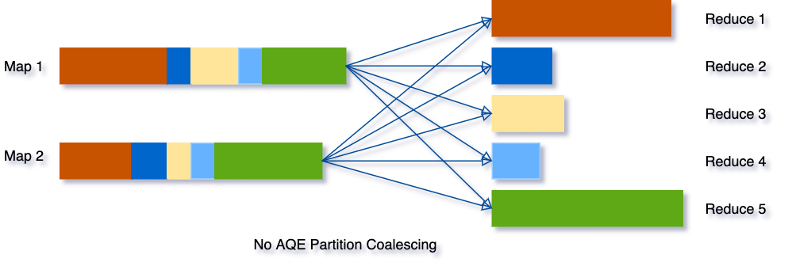
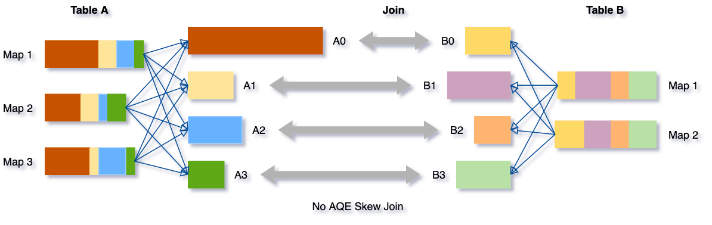

올해 회사에서 Spark 2.X -> 3.0 으로 버전을 올려서 사용하게 되었는데
spark 3.0부터 지원하는 기능인 Spark AQE(Adaptive Query Execution) 기능을 도입하여 사용중입니다.
제가 AQE에 잘 이해하고 사용중인지 해당 글을 통해 정리하려고합니다.

기존 Spark SQL의 쿼리 옵티마이저는 rule-based 또는 cost-based 의 방식을 가지며
3 버전대 이후로는 runtime 기반으로 동작하는 optimizer인 AQE(Adaptive Query Execution)가 추가되었습니다.

AQE는 다음과 같은 기능을 지원한다.
- Dynamically coalescing shuffle partitions
- Dynamically switching join strategies
- Dynamically optimizing skew joins

## Dynamically coalescing shuffle partitions
데이터를 처리하는 Spark 환경에서 쿼리를 실행시킬때의 셔플(Spark에서 데이터를 재분배하는 방법)은 일반적으로
쿼리성능에 중요한 영향을 미치게됩니다. 여기서 셔플의 주요속성인 파티션 수와 쿼리 성능에 매우 직접적인 연관이 있습니다.
따라서 아래와 같이 파티션의 크기가 너무 적거나 클때에는 다음과 같은 문제가 발생하였었습니다.
- 셔플 파티션 수가 적을때
  -  각 셔플 파티션 당 데이터 크기가 커짐에 따라 ram이 아닌 Disk를 사용하는 경우가 발생함에
     따라 쿼리 성능 저하
  
- 셔플 파티션 수가 클때
  - 파티션의 데이터 크기가 매우 작을 수 있고 셔플 블록을 읽기 위해 작은 네트워크 데이터를 많이 가져와서 비효율적인 I/O로 인해 쿼리 속도 저하

따라서 기존까지 위와 같은 단점들로 인해 적절한 수의 파티션을 결정하는것을 사람이 판단하여 최적화를 진행해왔었습니다.<br>
AQE 는 셔플 통계를 보고, 런타임에 많은 수의 작은(samll size) 셔플 파티션들을 합쳐 하나의 큰 파티션으로 뭉쳐주는 기능을 제공합니다.
기존의 방식으로 셔플을 진행하면, 아래 그림과 같이 5개의 셔플 파티션이 생기고 각 파티션마다 크기가 달라질 수 있다.

AQE는 이 세 개의 작은 파티션을 하나로 통합하므로 최종 집계는 이제 5개가 아닌 3개의 작업만 수행하면 됩니다
3개의 작업을 함에 따라 처리속도를 올릴 수 있습니다.


## Dynamically switching join strategies
Spark는 여러 조인 전략을 지원하며, 그 중 브로드캐스트 해시 조인은 일반적으로 조인의 한 쪽이 메모리에 잘 들어갈 수 있는 경우 가장 성능이 좋습니다. 
셔플이 끝난뒤 reoptimaization을 진행할때에 조인 전략이 바뀌어서 더 높은 성능을 낼 수 있다는 결과가 나왔을때에는 조인 전략이 바뀝니다.
어떤 조인에서 브로드캐스트 해시 조인으로 조인 전략이 바뀝니다.(브로드캐스트 해시 조인은 셔플은 사용하지 않아 성능이 좋다고 합니다.)

## Dynamically optimizing skew joins
데이터 스큐는 클러스터의 파티션 간에 데이터가 고르지 않게 분포될 때 발생합니다. 하나의 파티션에 데이터가 몰려있는 상황은 특히 조인의 경우 쿼리 성능을 크게 저하시킬 수 있습니다. 
아래의 예시를 들어 설명합니다.

테이블 A와 테이블 B를 서로 조인하는 상황이고, 테이블 A의 A0 파티션에 데이터가 몰려있습니다.
A와 B를 조인하는 과정에서 A0와 B0가 조인하는 시간이 A1,2,3 와 B1,2,3 가 조인하는 시간보다 오래 걸리므로 처리 속도가 떨어집니다.
AQE 에서는 이러한 skew 데이터를 감지하고, skew 데이터를 더 작은 하위 파티션으로 나눠집니다.

예제에서는 A0 를 A0-0 와 A0-1 로 나누고 A0의 나눈 수 만큼 B0 도 복제한다. 그 뒤 서로 조인을 진행합니다.
이렇게되면 A0과 B0의 조인 시간이 줄어들고 전체적인 처리 속도가 향상됩니다.

## AQE 활성화
Spark 3.x 이후 버전에서 SQL config 에 spark.sql.adaptive.enabled 을 true 로 세팅하면 AQE 를 사용할 수 있다.

shuffle partitions 활성화
```python
from pyspark.sql import SparkSession

spark = SparkSession.builder.getOrCreate()
spark.conf.set("spark.sql.adaptive.enabled",true)
spark.conf.set("spark.sql.adaptive.coalescePartitions.enabled",true)
```

skew join 활성화
```python
from pyspark.sql import SparkSession

spark = SparkSession.builder.getOrCreate()
spark.conf.set("spark.sql.adaptive.enabled",true)
spark.conf.set("spark.sql.adaptive.skewJoin.enabled",true)
```

구체적인 옵션은[Spark documentation](https://spark.apache.org/docs/latest/sql-performance-tuning.html#adaptive-query-execution) 를 통해 조절해서 사용이 가능하다.

##### 출처
1. [Adaptive Query Execution: Speeding Up Spark SQL at Runtime](https://databricks.com/blog/2020/05/29/adaptive-query-execution-speeding-up-spark-sql-at-runtime.html)<br>
2. [Spark SQL: Catalyst Optimizer](https://blog.bi-geek.com/en/spark-sql-optimizador-catalyst/)
3. [[Spark3] Adaptive Query Execution](https://eyeballs.tistory.com/245)
4. [Spark documentation](https://spark.apache.org/docs/latest/sql-performance-tuning.html#adaptive-query-execution)